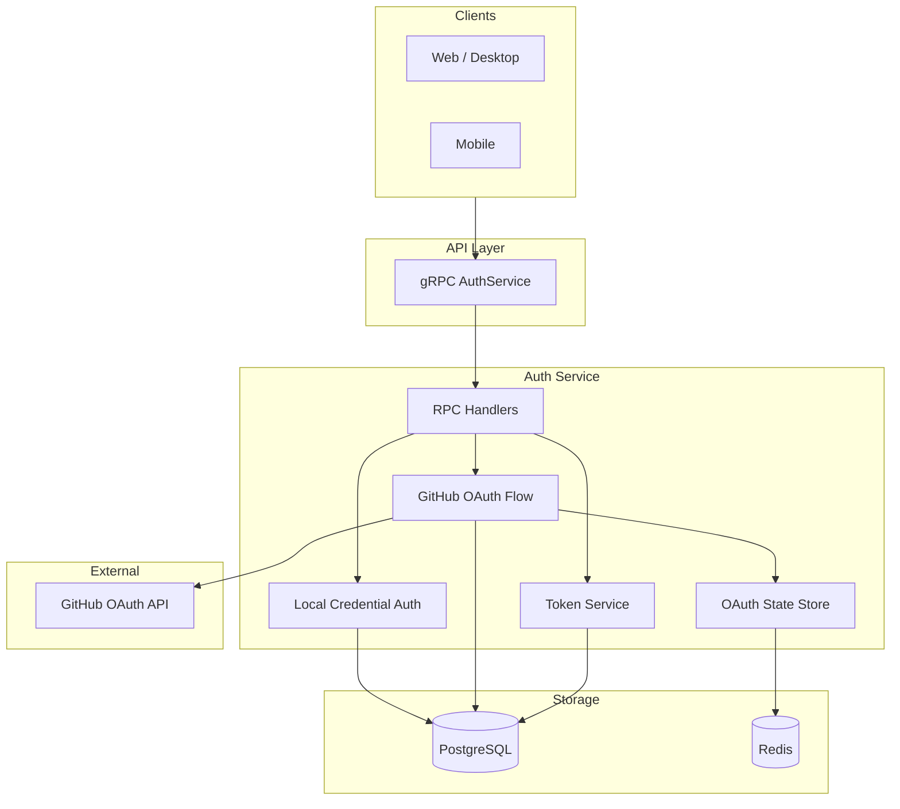
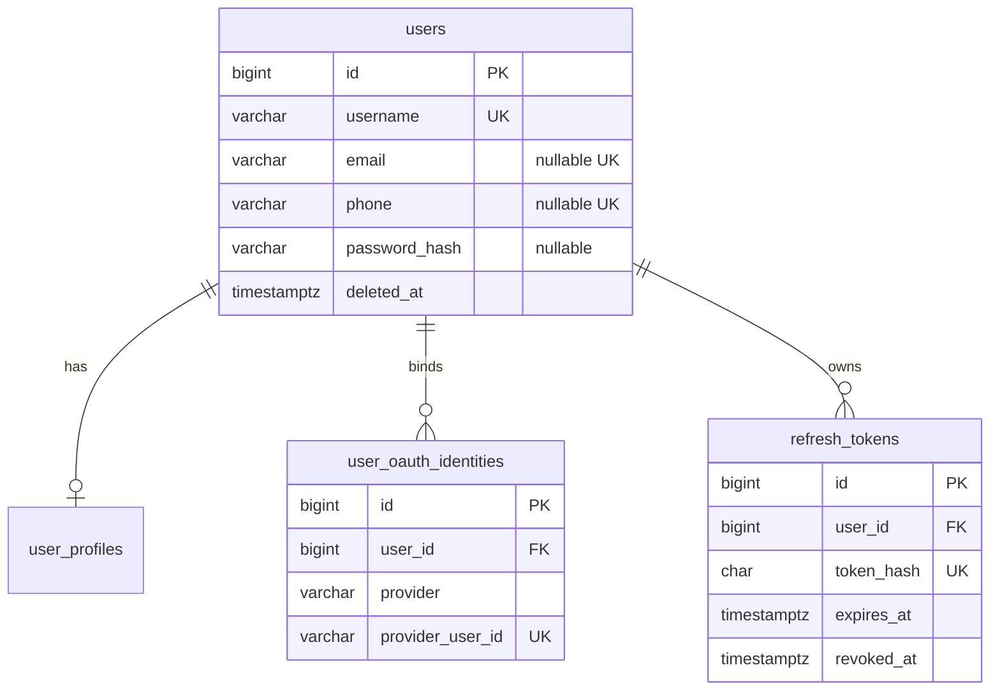
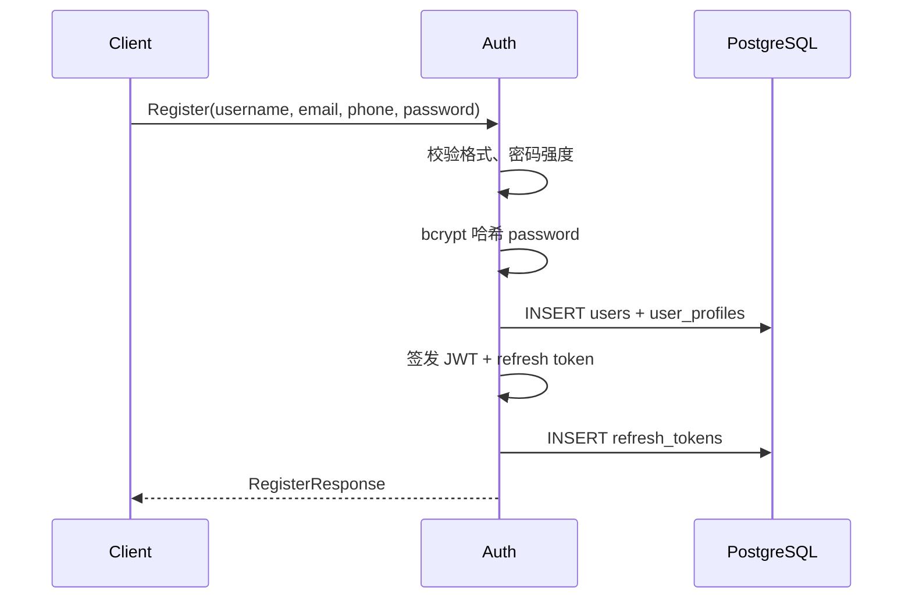
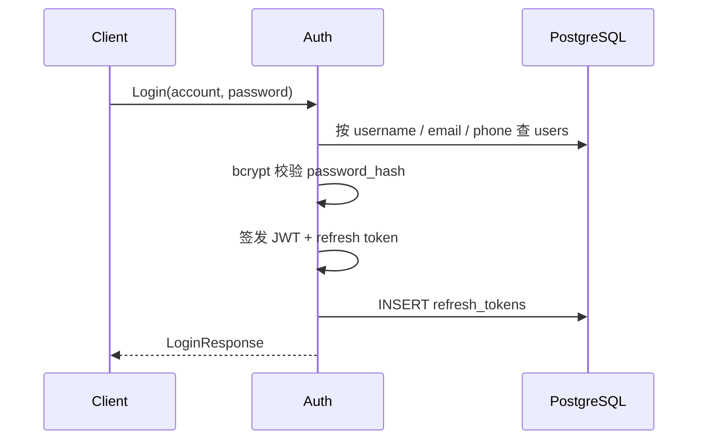
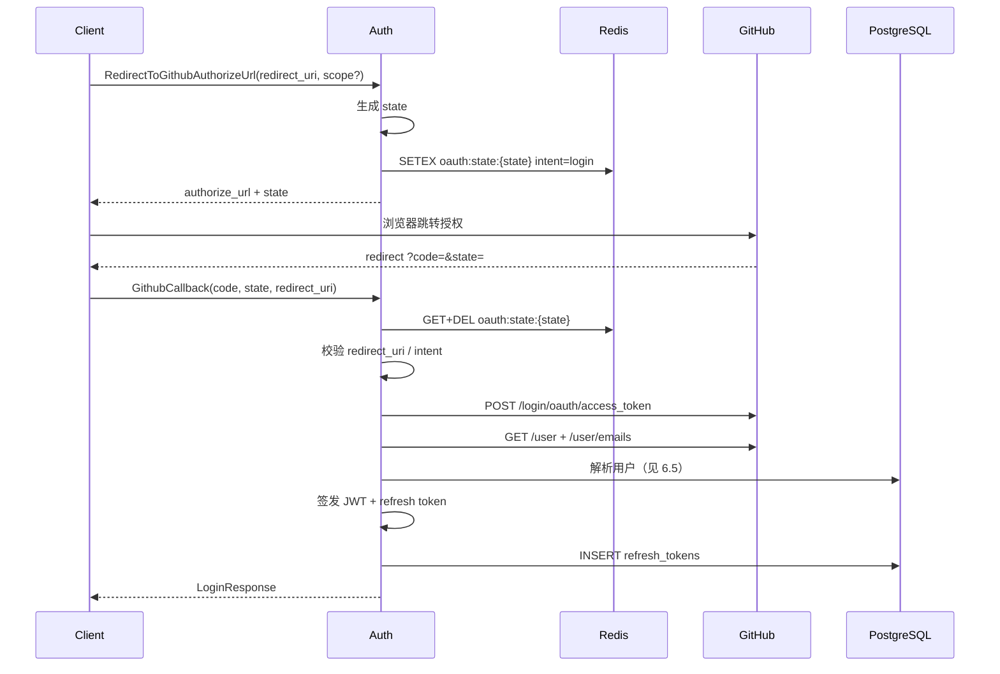
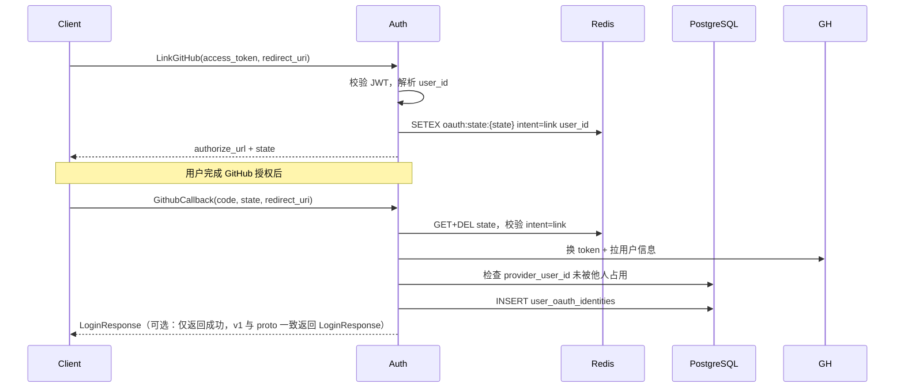
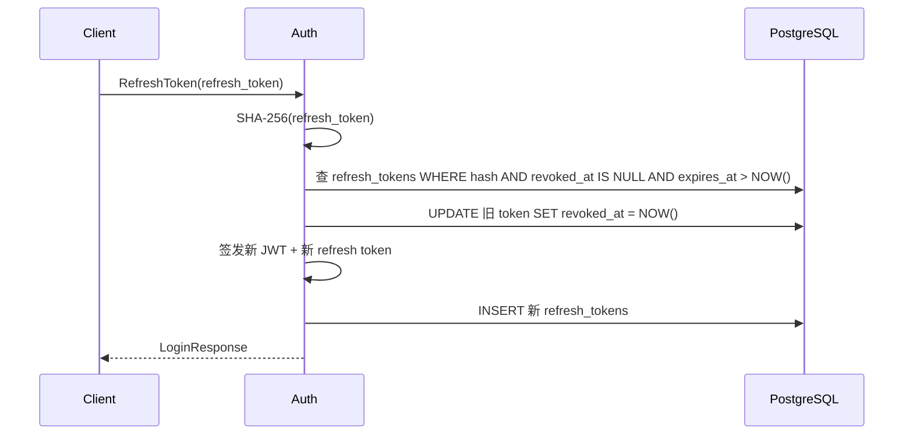
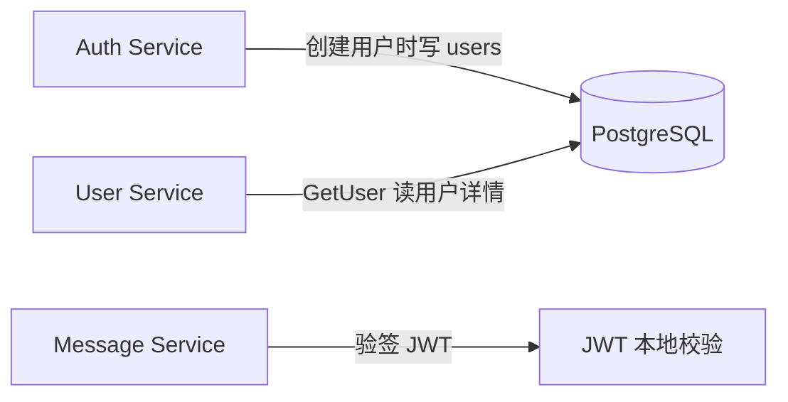

# Beehive-IM 认证模块设计文档

> 版本：v1.0  
> 适用范围：Auth 服务（gRPC）、本地账号登录、GitHub OAuth2 授权码模式  
> 关联文件：[`proto/auth.proto`](../../proto/auth.proto)、[`sql/migrations/users/001_user.sql`](../../sql/migrations/users/001_user.sql)、[`sql/migrations/auth/002_auth.sql`](../../sql/migrations/auth/002_auth.sql)

---

## 1. 目标与范围

### 1.1 目标

认证模块负责：

- 本地账号注册、登录、登出
- 访问令牌（access token）与刷新令牌（refresh token）的签发与轮换
- GitHub OAuth2 **授权码模式**登录与账号绑定
- 为其他微服务（User、Message 等）提供统一的身份凭证校验能力

### 1.2 非目标（v1 不做）

- 多 OAuth 提供方（Google、微信等）的具体实现（表结构已预留 `provider` 字段）
- 短信/邮箱验证码登录
- 细粒度 RBAC 权限系统
- 联邦 SSO（SAML、OIDC 通用 IdP）

---

## 2. 总体架构



### 2.1 存储职责划分

| 数据 | 存储 | 说明 |
|------|------|------|
| 用户账号 `users` / `user_profiles` | PostgreSQL | 持久化用户主数据，支持软删除 |
| OAuth 绑定 `user_oauth_identities` | PostgreSQL | 本地用户与 GitHub 账号的长期映射 |
| 刷新令牌 `refresh_tokens` | PostgreSQL | 仅存 SHA-256 哈希，支持撤销与多设备会话 |
| OAuth 授权 state | **Redis** | 短生命周期（默认 600s），一次性消费，自动 TTL 过期 |
| Access token | **无状态 JWT** | 不落库；由 Auth 服务签发，各服务本地校验 |

**设计原则**：持久化、需审计、需关联查询的数据放 PostgreSQL； ephemeral、高频读写、自带 TTL 的数据放 Redis。

---

## 3. 数据模型

### 3.1 ER 关系



### 3.2 用户类型

| 类型 | `password_hash` | `phone` | 登录方式 |
|------|-----------------|---------|----------|
| 本地注册用户 | 有 | 有（注册必填） | 账号 + 密码 |
| GitHub 纯 OAuth 用户 | NULL | NULL | GitHub 授权 |
| 混合用户 | 有 | 有/NULL | 密码或 GitHub（已绑定） |

### 3.3 Redis：OAuth State

**Key 格式**

```
oauth:state:{state}
```

**Value（JSON）**

```json
{
  "redirect_uri": "https://app.example.com/oauth/github/callback",
  "scope": "read:user user:email",
  "intent": "login",
  "user_id": null
}
```

`intent=link` 时 `user_id` 为当前登录用户的本地 ID（`BIGINT` 字符串）。

**TTL**：600 秒（与 `RedirectToGithubAuthorizeUrlResponse.expires_in` 一致）

**操作语义**

| 操作 | 命令 | 时机 |
|------|------|------|
| 创建 | `SETEX key 600 value` | `RedirectToGithubAuthorizeUrl` / `LinkGitHub` |
| 读取并删除 | `GET` + `DEL`（Lua 脚本保证原子性） | `GithubCallback` 校验通过后 |

`state` 生成：加密安全随机串，≥ 32 字节 hex（64 字符），满足 DB 时代 VARCHAR(64) 上限。

---

## 4. 令牌设计

### 4.1 Access Token（JWT）

| 属性 | 建议值 |
|------|--------|
| 算法 | HS256（内网）或 RS256（多服务验签） |
| 有效期 | 15 分钟 |
| 载荷 | `sub`（user_id）、`username`、`iat`、`exp`、`jti` |

- 不落库；过期后客户端用 refresh token 刷新
- 其他服务通过共享密钥或 JWKS 本地验签，无需每次回调 Auth

### 4.2 Refresh Token

| 属性 | 建议值 |
|------|--------|
| 格式 | 随机 32 字节 → Base64URL |
| 存储 | PostgreSQL `refresh_tokens.token_hash` = SHA-256(hex) |
| 有效期 | 30 天 |
| 轮换 | 每次 `RefreshToken` 签发新 refresh token，旧 token `revoked_at = NOW()` |

### 4.3 响应结构

`RegisterResponse` / `LoginResponse` / `RefreshToken` 统一返回：

```
access_token, refresh_token, expires_in, token_type="Bearer", user
```

---

## 5. gRPC 接口契约

定义见 [`proto/auth.proto`](../../proto/auth.proto)。

### 5.1 接口一览

| RPC | 鉴权 | 说明 |
|-----|------|------|
| `Register` | 无 | 本地注册并自动登录 |
| `Login` | 无 | 账号（用户名/邮箱/手机）+ 密码 |
| `Logout` | access 或 refresh | 撤销 refresh token |
| `RefreshToken` | refresh_token | 轮换令牌 |
| `RedirectToGithubAuthorizeUrl` | 无 | GitHub 登录 Step 1 |
| `GithubCallback` | 无 | GitHub 登录/绑定 Step 2 |
| `LinkGitHub` | access_token | 已登录用户绑定 GitHub Step 1 |
| `UnlinkGitHub` | access_token | 解绑 GitHub |

---

## 6. 核心业务流程

### 6.1 本地注册



**校验要点**

- `username` / `email` / `phone` 在未软删除记录中唯一
- 密码最小长度建议 8，禁止常见弱密码（实现层）

### 6.2 本地登录



拒绝枚举：用户不存在与密码错误返回相同错误码 `UNAUTHENTICATED`。

### 6.3 GitHub OAuth 登录



**GitHub API**

| 步骤 | 端点 |
|------|------|
| 换 token | `POST https://github.com/login/oauth/access_token` |
| 用户信息 | `GET https://api.github.com/user` |
| 邮箱 | `GET https://api.github.com/user/emails`（需 `user:email` scope） |

`client_id` / `client_secret` 仅服务端配置，**永不**进入 proto 或响应。

### 6.4 GitHub 绑定（已登录用户）



若 `(github, provider_user_id)` 已绑定其他 `user_id` → `ALREADY_EXISTS`。

### 6.5 GitHub 登录用户解析（自动绑定）

`GithubCallback` 在 `intent=login` 时按以下顺序：

1. **已绑定**：`(provider, provider_user_id)` 存在 → 取对应 `user_id` 登录
2. **邮箱匹配**：`provider_email` 命中 `users.email`（`deleted_at IS NULL`）→ 创建 `user_oauth_identities` 绑定，登录该用户
3. **新用户**：`INSERT users` + `user_profiles` + `user_oauth_identities`

新用户字段策略：

| 字段 | 来源 |
|------|------|
| `username` | GitHub `login`；冲突则 `{login}_{provider_user_id}` |
| `email` | GitHub 主邮箱（可为 NULL） |
| `phone` | NULL |
| `password_hash` | NULL |
| `user_profiles.avatar` | GitHub `avatar_url` |
| `user_profiles.nickname` | GitHub `name` 或 `login` |

### 6.6 解绑 GitHub

```
UnlinkGitHub(access_token)
```

1. 校验 JWT，取 `user_id`
2. 查 `user_oauth_identities WHERE user_id AND provider='github'`
3. **安全拒绝**：若 `users.password_hash IS NULL` 且仅有这一条 OAuth 绑定 → `FAILED_PRECONDITION`（防止账号锁死）
4. `DELETE FROM user_oauth_identities WHERE ...`

### 6.7 刷新令牌



### 6.8 登出

```
Logout(access_token?, refresh_token?)
```

- 优先按 `refresh_token` 哈希撤销对应行
- 若仅传 `access_token`，可通过 `jti` 黑名单（Redis，可选）或仅客户端丢弃（v1 最小实现：撤销 refresh）

---

## 7. 服务模块划分（Go 实现建议）

```
services/auth/
├── cmd/
│   └── main.go                 # 入口
├── pb/                         # protoc 生成
├── config/
│   └── config.go               # JWT、GitHub、Redis、PG 配置
├── internal/
│   ├── server/
│   │   └── grpc.go             # gRPC 注册
│   ├── handler/
│   │   └── auth_handler.go     # RPC 薄层，委托 service
│   ├── service/
│   │   ├── local_auth.go       # Register / Login
│   │   ├── oauth_github.go     # Redirect / Callback / Link / Unlink
│   │   ├── token.go            # 签发、刷新、撤销
│   │   └── user_resolver.go    # GitHub 用户解析与自动绑定
│   ├── repository/
│   │   ├── user_repo.go
│   │   ├── oauth_identity_repo.go
│   │   └── refresh_token_repo.go
│   ├── oauth/
│   │   ├── github_client.go    # HTTP 调用 GitHub API
│   │   └── state_store.go      # Redis OAuth state 接口
│   └── middleware/
│       └── auth_interceptor.go # 从 metadata 解析 JWT（供 Link/Unlink）
└── pkg/
    └── password/               # bcrypt 封装
```

### 7.1 关键接口

```go
// OAuthStateStore stores short-lived CSRF state in Redis.
// OAuthStateStore 在 Redis 中存储短期 CSRF state。
type OAuthStateStore interface {
    Save(ctx context.Context, state string, payload OAuthState, ttl time.Duration) error
    Consume(ctx context.Context, state string) (OAuthState, error) // 原子读取并删除
}

type OAuthState struct {
    RedirectURI string
    Scope       string
    Intent      string // "login" | "link"
    UserID      *int64 // link 时非空
}
```

---

## 8. 配置项

| 环境变量 | 说明 | 示例 |
|----------|------|------|
| `DB_DSN` | PostgreSQL 连接串 | `postgres://...@127.0.0.1:5432/Beehive-IM` |
| `REDIS_ADDR` | Redis 地址 | `127.0.0.1:6379` |
| `JWT_SECRET` | HS256 密钥 | 随机 32+ 字节 |
| `JWT_ACCESS_TTL` | Access token 有效期 | `15m` |
| `JWT_REFRESH_TTL` | Refresh token 有效期 | `720h` |
| `GITHUB_CLIENT_ID` | GitHub OAuth App ID | — |
| `GITHUB_CLIENT_SECRET` | GitHub OAuth App Secret | — |
| `GITHUB_DEFAULT_SCOPE` | 默认 scope | `read:user user:email` |
| `OAUTH_STATE_TTL` | Redis state TTL | `600s` |

本地基础设施见 [`docker/Infrastructure/docker-compose.yaml`](../../docker/Infrastructure/docker-compose.yaml)（PostgreSQL 16 + Redis 8）。

---

## 9. 安全要求

| 项 | 要求 |
|----|------|
| 密码 | bcrypt，cost ≥ 12 |
| OAuth state | 加密随机、一次性消费、Redis TTL |
| redirect_uri | 白名单校验，必须与 Step 1 一致 |
| GitHub token | 仅服务端使用，不返回客户端 |
| refresh token | 仅存哈希；轮换时撤销旧 token |
| 错误信息 | 登录失败不区分「用户不存在」与「密码错误」 |
| Unlink | 无密码且唯一 OAuth 来源时禁止解绑 |
| 传输 | 生产环境全链路 HTTPS |

### 9.1 gRPC 错误码映射（建议）

| 场景 | gRPC Code |
|------|-----------|
| 凭证无效 | `UNAUTHENTICATED` |
| state 无效/过期 | `INVALID_ARGUMENT` |
| GitHub 账号已被他人绑定 | `ALREADY_EXISTS` |
| 解绑导致账号不可登录 | `FAILED_PRECONDITION` |
| 用户已软删除 | `NOT_FOUND` |

---

## 10. 与其他服务协作



- **Auth** 在注册 / GitHub 新用户流程中写入 `users` / `user_profiles`
- **User Service**（[`proto/user.proto`](../../proto/user.proto)）负责用户资料查询与后续更新，不处理认证
- 下游服务从 gRPC metadata `authorization: Bearer {access_token}` 读取 JWT，**无需**每次 RPC 回调 Auth（除非要做实时 revoke 黑名单）

---

## 11. 运维与清理

| 任务 | 方式 |
|------|------|
| 过期 OAuth state | Redis TTL 自动清理，无需 job |
| 过期 refresh token | 定时任务 `DELETE FROM refresh_tokens WHERE expires_at < NOW() - interval '7 days'` |
| 已撤销 refresh token | 同上，或保留 30 天审计后清理 |

---

## 12. 演进路线

| 阶段 | 内容 |
|------|------|
| v1（当前） | 本地账号 + GitHub OAuth + Redis state |
| v1.1 | access token 黑名单（Redis `jwt:bl:{jti}`）支持即时登出 |
| v2 | 多 OAuth 提供方插件化（`provider` 枚举 + `OAuthProvider` 接口） |
| v2 | `LogoutAllDevices(user_id)`、设备指纹 |
| v3 | RS256 + JWKS 端点供多服务验签 |

---

## 13. 附录：Proto 与表结构对照

| Proto RPC | 主要写库 | Redis |
|-----------|----------|-------|
| `Register` | users, user_profiles, refresh_tokens | — |
| `Login` | refresh_tokens | — |
| `Logout` | refresh_tokens (revoke) | — |
| `RefreshToken` | refresh_tokens (revoke + insert) | — |
| `RedirectToGithubAuthorizeUrl` | — | SETEX state |
| `GithubCallback` | users*, user_oauth_identities*, refresh_tokens | GET+DEL state |
| `LinkGitHub` | — | SETEX state (intent=link) |
| `UnlinkGitHub` | DELETE user_oauth_identities | — |

\* 视用户是否已存在而定。
