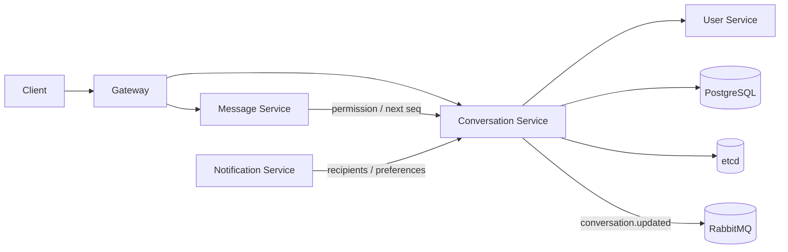

# Beehive-IM Conversation 服务设计文档

> 版本：v1.0
> 适用范围：会话、成员、权限、会话设置、通知偏好、消息序号分配协作
> 关联文件：[`docs/message/DESIGN.md`](../message/DESIGN.md)、[`docs/notification/DESIGN.md`](../notification/DESIGN.md)、[`docs/gateway/DESIGN.md`](../gateway/DESIGN.md)、[`docs/infrastructure/DESIGN.md`](../infrastructure/DESIGN.md)

---

## 1. 目标与范围

Conversation 服务是 IM 系统的会话事实边界，负责维护会话、成员、权限和会话级设置。Message 服务负责消息事实；Presence 服务负责在线态；Notification 服务负责通知编排。Conversation 必须为 Message 和 Notification 提供一致的成员与权限判断，避免这些规则散落在多个服务里。

### 1.1 职责

| 职责 | 说明 |
|------|------|
| 会话生命周期 | 创建单聊、群聊，维护会话状态 |
| 成员管理 | 加入、移除、角色变更、禁言、退出 |
| 权限判断 | 校验用户是否可发消息、拉取消息、管理成员 |
| 会话设置 | 置顶、免打扰、昵称、消息提醒策略 |
| 序号协作 | 为 Message 提供会话级序号分配 |
| 事件发布 | 后续发布 `conversation.updated.{conversation_id}` 等领域事件 |

### 1.2 当前实现状态

| 能力 | 当前状态 |
|------|----------|
| Proto / 服务 | 已新增 `proto/conversation.proto` 与 `services/conversation` zRPC |
| PostgreSQL | 已新增 `sql/migrations/conversations/003_conversation.sql` |
| 基础 API | 已实现创建、查询、列表、成员新增/移除、角色更新、用户设置更新 |
| 权限 | 已实现 active 成员、owner/admin 管理成员、用户只能改自己的会话设置 |
| 发送权限 | 已实现 `CheckSendPermission`，校验会话 active、成员 active、未超过 `muted_until` |
| 读取权限 | 已实现 `CheckReadPermission`，校验会话 active、成员 active |
| 通知收件人 | 已实现 `ResolveMessageRecipients`，返回 active members，供 Notification 查询在线路由 |
| 序号 | 已实现 `AllocateMessageSeq`，事务行锁递增 `conversations.current_seq` |
| 事件 | 本阶段尚未发布 conversation 领域事件 |

### 1.3 非职责

- 不保存消息正文。
- 不管理 WebSocket 连接和在线态。
- 不直接调用离线推送 provider。
- 不负责用户基础资料事实，用户资料仍属于 User 服务。

---

## 2. 总体架构

---

## 3. API 契约

v1 推荐使用 gRPC。所有写接口必须带幂等 key 或业务唯一约束，所有读写必须带 deadline。

| RPC | 调用方 | 说明 |
|-----|--------|------|
| `CreateConversation` | Gateway / API | 创建单聊或群聊 |
| `GetConversation` | Gateway / Message / Notification | 查询会话基础信息 |
| `ListConversations` | Gateway / API | 查询用户会话列表 |
| `AddMembers` | Gateway / API | 添加成员 |
| `RemoveMembers` | Gateway / API | 移除成员 |
| `UpdateMemberRole` | Gateway / API | 变更成员角色 |
| `UpdateConversationSettings` | Gateway / API | 修改会话设置 |
| `CheckSendPermission` | Message | 校验发送权限 |
| `CheckReadPermission` | Message | 校验历史消息和同步读取权限 |
| `AllocateMessageSeq` | Message | 分配会话内单调递增消息序号 |
| `ResolveMessageRecipients` | Notification | 解析消息通知收件人，当前返回 active members |

### 3.1 权限语义

| 权限 | 判断依据 |
|------|----------|
| 发消息 | 成员存在、未被移除、未被禁言、会话未关闭 |
| 拉消息 | 成员存在，且查询范围不早于成员可见起点 |
| 管理成员 | 成员角色满足 owner/admin |
| 修改设置 | 用户级设置由本人修改；群级设置需管理员权限 |

---

## 4. 数据模型

### 4.1 PostgreSQL

| 表 | 说明 |
|----|------|
| `conversations` | 会话主表，保存类型、状态、当前消息序号 |
| `conversation_members` | 成员关系、角色、状态、禁言截止时间 |
| `conversation_settings` | 用户级会话设置 |
| `conversation_events` | 计划中：可选审计事件表 |

`conversations` 建议字段：

| 字段 | 说明 |
|------|------|
| `conversation_id` | 会话 ID |
| `type` | 当前支持 `direct`、`group` |
| `status` | 当前支持 `active`、`closed` |
| `current_seq` | 会话内最新消息序号 |
| `owner_user_id` | 创建者/拥有者 |
| `created_at` / `updated_at` / `deleted_at` | 生命周期时间 |

`conversation_members` 建议字段：

| 字段 | 说明 |
|------|------|
| `conversation_id` | 会话 ID |
| `user_id` | 用户 ID |
| `role` | `owner`、`admin`、`member` |
| `status` | 当前支持 `active`、`removed` |
| `muted_until` | 禁言截止时间，NULL 表示未禁言 |
| `joined_at` | 加入时间 |
| `updated_at` | 更新时间 |

### 4.2 序号分配

会话序号必须单调递增，建议二选一：

| 方案 | 说明 |
|------|------|
| Conversation 分配 | Message 写入前调用 `AllocateMessageSeq`，由 Conversation 原子递增 `current_seq` |
| Message 分配并回写 | Message 在同一事务内使用会话行锁或唯一索引分配序号，再发布事件 |

当前实现采用 Conversation 提供 `AllocateMessageSeq`：在事务中锁定 `conversations` 行并递增 `current_seq`。由于 Message 写库位于另一个服务事务中，Message 持久化失败可能留下 seq gap；客户端和后续同步接口必须按缺口补偿处理，不能要求会话 seq 物理无间隙。Message 写入仍以 PostgreSQL 唯一索引 `conversation_id + seq` 兜底。

---

## 5. 事件

| Routing key | 触发场景 | 消费方 |
|-------------|----------|--------|
| `conversation.created.{conversation_id}` | 创建会话 | Notification、Audit、Search |
| `conversation.updated.{conversation_id}` | 名称、头像、设置、成员变更 | Notification、Client sync |
| `conversation.member_changed.{conversation_id}` | 成员加入、移除、角色变更 | Notification、Audit |

事件 payload 必须包含 `event_id`、`conversation_id`、`operator_id`、`occurred_at` 和变更摘要。敏感字段不得进入日志或无权限消费者。

---

## 6. 与其他服务协作

| 服务 | 协作方式 |
|------|----------|
| Gateway | 转发客户端会话管理请求；不直接修改数据库 |
| Message | 发送前校验权限，获取或校验会话序号 |
| Notification | 解析 active 收件人；免打扰、离线通知策略后续扩展 |
| User | 查询用户基础资料快照，不拥有用户事实 |
| Presence | 无直接依赖；在线态由 Notification 查询 Presence |

---

## 7. 安全与并发

| 项 | 要求 |
|----|------|
| 权限 | 所有写操作必须校验操作者成员身份和角色 |
| 幂等 | 创建会话、添加成员、设置修改必须支持幂等 |
| 并发 | 成员变更和消息序号分配必须使用事务、行锁或唯一索引兜底 |
| 隐私 | 非成员不得查询会话详情和成员列表 |
| 日志 | 英文结构化日志，禁止输出完整手机号、邮箱、token 和 secret |

---

## 8. 可观测性

| 指标 | 说明 |
|------|------|
| `conversation_create_latency_ms` | 创建会话延迟 |
| `conversation_permission_check_latency_ms` | 权限校验延迟 |
| `conversation_seq_allocate_latency_ms` | 序号分配延迟 |
| `conversation_member_change_total` | 成员变更次数 |
| `conversation_event_publish_failed_total` | 事件发布失败次数 |

---

## 9. 验收清单

- [x] Message 发送前通过 Conversation 校验成员权限。
- [x] 会话序号具备单调递增保证，并有 Message 唯一索引兜底。
- [x] Notification 不自行维护成员关系，统一调用 Conversation；免打扰规则后续扩展。
- [ ] 成员变更发布 `conversation.updated.#` 或等价领域事件。
- [x] 会话基础读写接口具备权限校验和明确错误码。
