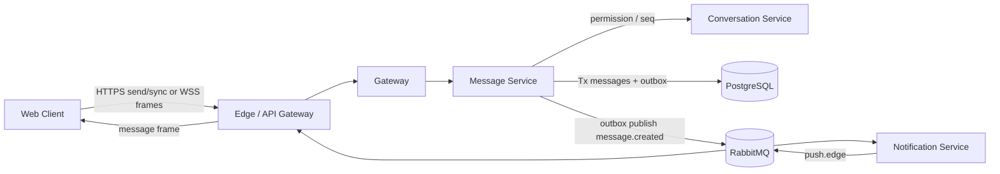
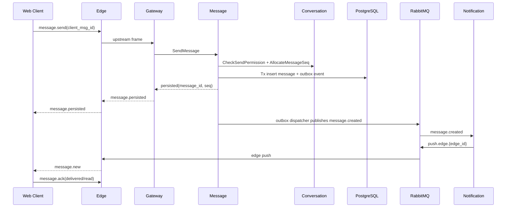
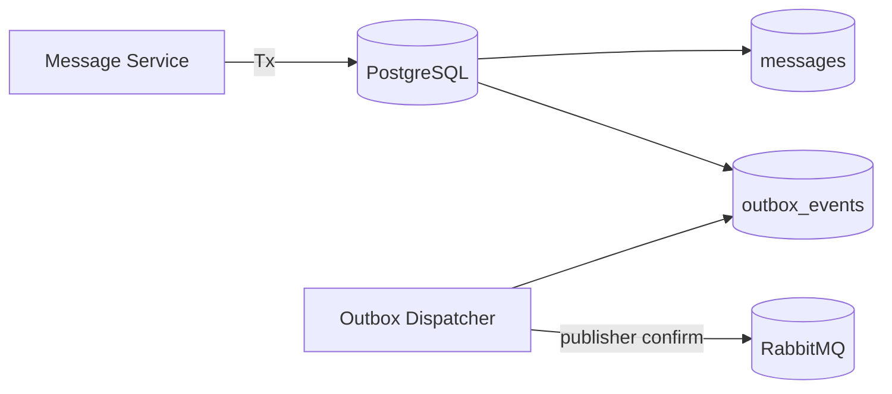
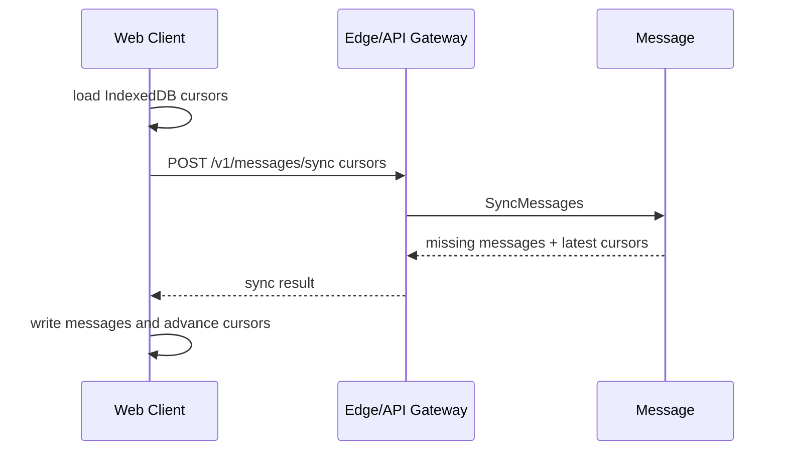
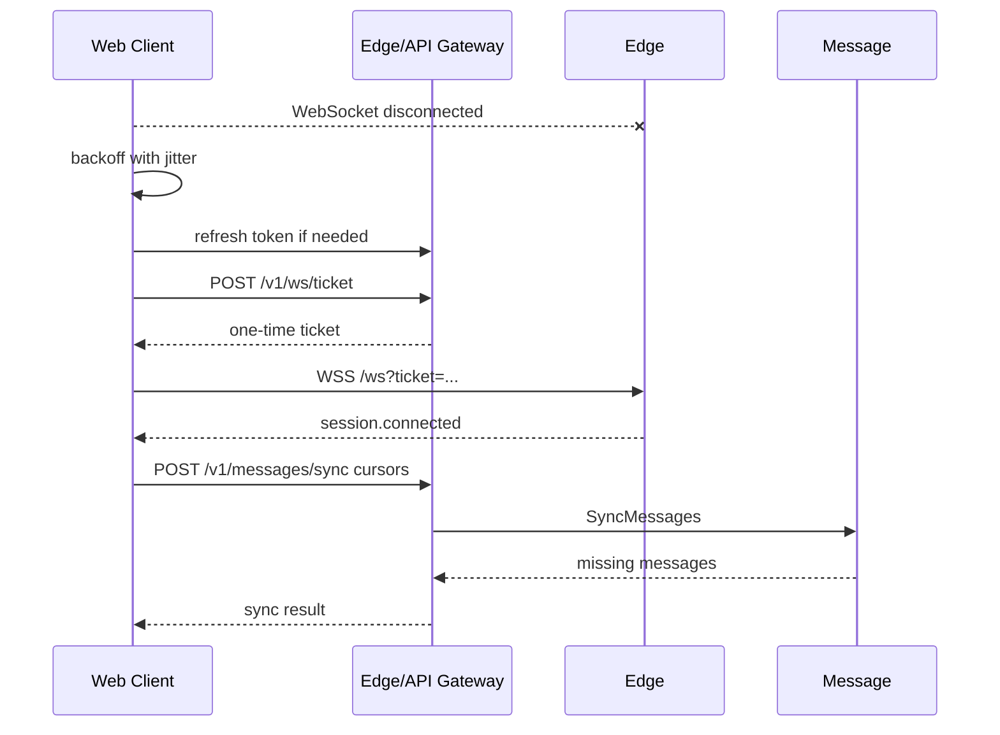

# Beehive-IM Message 服务与 Web 客户端同步设计文档

> 版本：v1.0
> 适用范围：Message 服务、消息持久化、Outbox、消息同步、Web 客户端重连与补偿协议
> 关联文件：[`docs/gateway/DESIGN.md`](../gateway/DESIGN.md)、[`docs/conversation/DESIGN.md`](../conversation/DESIGN.md)、[`docs/notification/DESIGN.md`](../notification/DESIGN.md)、[`docs/presence/DESIGN.md`](../presence/DESIGN.md)、[`docs/infrastructure/DESIGN.md`](../infrastructure/DESIGN.md)

---

## 1. 目标与范围

Message 服务是 IM 消息事实边界，负责消息写入、会话内序号、消息同步、回执和 outbox 事件发布。Notification 只消费消息事件做在线/离线通知，不能成为消息事实源；Edge 和 Gateway 只承载连接与协议转发，不保存长期消息状态。

现阶段客户端只考虑 Web 端。Web 客户端协议必须处理浏览器限制、多标签页、断网重连、重复提交、乱序推送和本地缓存恢复。

### 1.1 职责

| 职责 | 说明 |
|------|------|
| 消息写入 | 校验发送权限，分配会话内 `seq`，持久化消息 |
| 幂等发送 | 使用 `sender_id + device_id + client_msg_id` 保证重复发送返回同一结果 |
| 消息同步 | 按 `conversation_id + seq` 提供增量拉取和缺口补齐 |
| 消息回执 | 接收 Web 客户端 delivered/read ack，写入回执表 |
| Outbox | 消息落库同事务写入 `outbox_events`，由 dispatcher 可靠发布领域事件 |
| Web 协议 | 定义浏览器连接、重连、IndexedDB 游标和多标签页协作规则 |

### 1.2 非职责

- 不管理 WebSocket 连接，连接由 Edge/Gateway 负责。
- 不查询 Presence，也不直接发布 `push.edge`。
- 不解析 Notification 离线 provider 策略。
- 不维护会话成员、免打扰和管理权限，这些属于 Conversation。
- v1 不做移动端原生协议、端到端加密、附件大文件存储和全文检索。

### 1.3 关键决策

| 决策 | 选择 |
|------|------|
| 消息事实源 | PostgreSQL `messages` |
| 会话序号 | 每个 `conversation_id` 内单调递增 `seq` |
| 发送幂等 | `sender_id + device_id + client_msg_id` 唯一 |
| 推送可靠性 | WebSocket push 是通知，不是可靠事实 |
| 补偿同步 | Web 客户端按 `conversation_id + last_contiguous_seq` 拉取缺失消息 |
| WebSocket 鉴权 | Web 端使用一次性短 TTL `ws_ticket`，不把 JWT 放入 WS query |
| 多标签页 | 同一浏览器 profile 只保留一个 WebSocket leader tab |

---

## 2. 总体架构



### 2.1 数据流闭环



发送方收到 `message.persisted` 只代表服务端已持久化，不代表其他客户端已接收。接收方收到 `message.new` 后仍要按 `seq` 校验是否有缺口。

---

## 3. 服务 API 契约

Web 客户端通过 Edge/API Gateway 暴露的 HTTP JSON API 或 WebSocket frame 访问；内部服务建议使用 gRPC。HTTP 和 WebSocket 入口必须复用同一组 Message 应用服务，避免两套语义。

### 3.1 Web HTTP API

| API | 说明 |
|-----|------|
| `POST /v1/ws/ticket` | 使用已认证 HTTP 会话换取一次性 WebSocket ticket |
| `POST /v1/conversations/{conversation_id}/messages` | HTTP 发送消息，断线补偿时可用 |
| `GET /v1/conversations/{conversation_id}/messages?after_seq=&limit=` | 拉取某会话增量消息 |
| `POST /v1/messages/sync` | 批量按多个会话 cursor 拉取缺失消息 |
| `POST /v1/messages/ack` | 上报 delivered/read 回执 |

`POST /v1/ws/ticket` 返回：

```json
{
  "ticket": "wst_opaque_random",
  "expires_in": 30,
  "session_id": "sess_01",
  "device_id": "web_device_01"
}
```

生产 ticket 要求：

- TTL 默认 30s，最多 60s。
- 单次使用，消费后立即失效。
- 绑定 `user_id`、`device_id`、`session_id`、origin 和 user-agent hash。
- ticket 可放入 WebSocket query；JWT/access token 禁止放入 query。

当前 MVP 实现状态：

| 能力 | 当前状态 |
|------|----------|
| 签发入口 | `POST /v1/ws/ticket` 已在 Edge 服务实现 |
| Web 端连接 | `GET /ws?ticket=...` 已在 Edge 服务实现 WebSocket upgrade |
| ticket 存储 | 当前为 Edge 进程内内存 store，只适合单 Edge 本地开发 |
| 鉴权来源 | 当前暂用 `X-Debug-User-Id` 开发头，后续替换为 Auth/JWT |
| 绑定字段 | 当前绑定 `user_id`、`device_id`、`session_id`、Origin；user-agent hash 后续补齐 |
| 消息同步 | 本轮未接入 Message，同步/补偿协议仍按本文后续章节实现 |

### 3.2 内部 gRPC API

| RPC | 调用方 | 说明 |
|-----|--------|------|
| `SendMessage` | Gateway / API Gateway | 发送消息并持久化 |
| `SyncMessages` | API Gateway / Gateway | 按 cursor 批量同步缺失消息 |
| `ListMessages` | API Gateway | 拉取单会话消息列表 |
| `AckMessages` | Gateway / API Gateway | 写 delivered/read 回执 |
| `GetConversationMaxSeq` | Gateway / API Gateway | 查询会话当前最大序号 |

### 3.3 SendMessage 请求

```json
{
  "conversation_id": "conv_01",
  "client_msg_id": "01J4WEB7Y6G7Y4V5S8K6Z9G8T1",
  "device_id": "web_device_01",
  "content_type": "text",
  "content": {
    "text": "hello"
  },
  "reply_to_message_id": null
}
```

字段要求：

| 字段 | 要求 |
|------|------|
| `conversation_id` | 必填，服务端校验用户是否是成员 |
| `client_msg_id` | 必填，Web 端生成 ULID/UUID，单设备内唯一 |
| `device_id` | 来自服务端登记或 Web 本地持久化，禁止由请求任意覆盖用户身份 |
| `content_type` | v1 支持 `text`、`system`；附件后续扩展 |
| `content` | JSONB，服务端按类型校验大小和字段 |

成功响应：

```json
{
  "message_id": "msg_01",
  "conversation_id": "conv_01",
  "client_msg_id": "01J4WEB7Y6G7Y4V5S8K6Z9G8T1",
  "seq": 1024,
  "sender_id": 1001,
  "created_at": "2026-06-20T04:00:00Z",
  "status": "persisted"
}
```

重复提交同一 `sender_id + device_id + client_msg_id` 必须返回第一次持久化的结果，不能插入第二条消息。

---

## 4. 数据模型

### 4.1 PostgreSQL 表

| 表 | 说明 |
|----|------|
| `messages` | 消息事实表 |
| `message_receipts` | 用户维度 delivered/read 回执 |
| `outbox_events` | 待发布领域事件 |

`messages` 建议字段：

| 字段 | 说明 |
|------|------|
| `id` | 消息 ID，UUID/雪花 ID |
| `conversation_id` | 会话 ID |
| `seq` | 会话内单调递增序号 |
| `sender_id` | 发送者用户 ID |
| `device_id` | 发送设备 ID |
| `client_msg_id` | Web 客户端生成的幂等 ID |
| `content_type` | 消息类型 |
| `content` | JSONB 内容 |
| `status` | `normal`、`recalled`、`deleted` |
| `created_at` / `updated_at` | 生命周期时间 |

唯一约束：

| 约束 | 说明 |
|------|------|
| `UNIQUE(conversation_id, seq)` | 保证会话内序号唯一 |
| `UNIQUE(sender_id, device_id, client_msg_id)` | 保证发送幂等 |

`message_receipts` 建议字段：

| 字段 | 说明 |
|------|------|
| `message_id` | 消息 ID |
| `conversation_id` | 会话 ID |
| `user_id` | 回执用户 |
| `delivered_at` | Web 客户端持久化到本地后的时间 |
| `read_at` | 用户实际读到该消息的时间 |

`outbox_events` 的 `payload` 必须包含 `event_id`、`message_id`、`conversation_id`、`seq`、`sender_id`、`created_at`。

### 4.2 序号分配

v1 使用 Conversation `AllocateMessageSeq` 分配会话内序号，Message 在同一写入流程中持久化消息。Message 仍必须依赖 `UNIQUE(conversation_id, seq)` 兜底，处理重试或并发下的重复序号。

如果后续把序号分配移动到 Message 内部，必须保证会话行锁、唯一索引和事务边界仍然清晰，不能让 Gateway 或客户端参与序号分配。

---

## 5. Outbox 与事件

消息持久化和 outbox 写入必须在同一数据库事务中完成。



### 5.1 message.created 事件

Routing key：

```text
message.created.{conversation_id}
```

Payload：

```json
{
  "event_id": "evt_01",
  "event_type": "message.created",
  "message_id": "msg_01",
  "conversation_id": "conv_01",
  "seq": 1024,
  "sender_id": 1001,
  "content_type": "text",
  "preview": "short safe preview",
  "created_at": "2026-06-20T04:00:00Z"
}
```

事件中只放通知和同步所需的最小载荷。完整消息内容以 Message 查询结果为准；敏感内容不得进入无权限消费者。

### 5.2 Dispatcher 要求

- 使用 `SELECT ... FOR UPDATE SKIP LOCKED` 支持多实例并发。
- RabbitMQ publisher confirm 成功后才能标记 outbox `published`。
- 失败使用指数退避和最大重试次数，超过阈值进入 DLQ 或人工处理队列。
- 发布重试必须幂等，消费者以 `event_id` 去重。

---

## 6. WebSocket 帧

Gateway 文档中的 WebSocket 信封 `seq` 是传输帧序号；Message 的 `payload.message.seq` 是会话内消息序号。实现和前端状态管理中必须区分这两类序号。

### 6.1 message.send

```json
{
  "type": "message.send",
  "seq": 101,
  "request_id": "req_01",
  "payload": {
    "conversation_id": "conv_01",
    "client_msg_id": "01J4WEB7Y6G7Y4V5S8K6Z9G8T1",
    "content_type": "text",
    "content": {
      "text": "hello"
    }
  }
}
```

### 6.2 message.persisted

```json
{
  "type": "message.persisted",
  "seq": 201,
  "request_id": "req_01",
  "payload": {
    "message_id": "msg_01",
    "conversation_id": "conv_01",
    "client_msg_id": "01J4WEB7Y6G7Y4V5S8K6Z9G8T1",
    "message_seq": 1024,
    "created_at": "2026-06-20T04:00:00Z"
  }
}
```

### 6.3 message.new

```json
{
  "type": "message.new",
  "seq": 202,
  "payload": {
    "message": {
      "message_id": "msg_02",
      "conversation_id": "conv_01",
      "seq": 1025,
      "sender_id": 1002,
      "content_type": "text",
      "content": {
        "text": "world"
      },
      "created_at": "2026-06-20T04:00:01Z"
    }
  }
}
```

### 6.4 message.ack

Web 客户端在消息写入 IndexedDB 后发送 delivered ack；用户实际打开会话并看到消息后发送 read ack。

```json
{
  "type": "message.ack",
  "seq": 203,
  "payload": {
    "conversation_id": "conv_01",
    "acks": [
      {
        "message_id": "msg_02",
        "seq": 1025,
        "ack_type": "delivered"
      }
    ]
  }
}
```

read ack 可以按会话批量上报到最大已读序号：

```json
{
  "type": "message.ack",
  "seq": 204,
  "payload": {
    "conversation_id": "conv_01",
    "read_up_to_seq": 1025,
    "ack_type": "read"
  }
}
```

---

## 7. Web 客户端同步协议

### 7.1 本地状态

Web 客户端必须使用 IndexedDB 保存可恢复状态。

| 数据 | 存储 | 说明 |
|------|------|------|
| `device_id` | IndexedDB 或 localStorage | 浏览器 profile 级设备 ID，登出不必删除 |
| `session_id` | IndexedDB | 最近一次 Edge session ID，用于重连恢复 |
| `conversation_cursor` | IndexedDB | `conversation_id -> last_contiguous_seq` |
| `messages` | IndexedDB | 最近消息缓存，用于首屏和离线展示 |
| `pending_outbox` | IndexedDB | 未持久化或未确认的本地发送消息 |

`last_contiguous_seq` 只在本地已经连续保存所有小于等于该序号的消息后推进。收到更大的 `seq` 时不能直接跳跃推进。

### 7.2 多标签页模型

同一浏览器 profile 只允许一个 leader tab 维护 WebSocket：

1. 使用 Web Locks API 竞争 `beehive-im-ws-leader`。
2. leader tab 建立 WebSocket、接收 push、写 IndexedDB。
3. leader tab 通过 `BroadcastChannel("beehive-im")` 通知其他 tab 更新 UI。
4. follower tab 发送消息时写入 IndexedDB `pending_outbox`，再通过 BroadcastChannel 请求 leader 发送。
5. leader tab 关闭或失去锁后，其他 tab 重新竞选。

如果浏览器不支持 Web Locks API，降级为 localStorage lease，但 lease 必须有短 TTL，避免异常关闭后长期无 leader。

### 7.3 首次加载



首屏可以先展示 IndexedDB 缓存，再异步同步服务端缺失消息。同步接口必须支持分页，单次返回上限默认 100 到 500 条。

### 7.4 在线 push 处理

收到 `message.new` 时：

1. 读取本地 `last_contiguous_seq`。
2. 如果 `message.seq <= last_contiguous_seq`，视为重复 push，直接丢弃或刷新消息状态。
3. 如果 `message.seq == last_contiguous_seq + 1`，写入 IndexedDB 并推进 cursor。
4. 如果 `message.seq > last_contiguous_seq + 1`，先调用 `SyncMessages(after_seq=last_contiguous_seq)` 补齐缺口，再应用当前 push。
5. 写入成功后发送 delivered ack。

### 7.5 断线重连



重连策略：

| 项 | 要求 |
|----|------|
| 退避 | `1s -> 2s -> 4s -> 8s -> 16s -> 30s`，带随机 jitter |
| ticket | 每次重连重新申请，不复用旧 ticket |
| token | access token 过期时先刷新，再申请 ticket |
| session | 尽量携带旧 `session_id`，但不能依赖它保证消息完整 |
| sync | WebSocket 连接成功后必须按本地 cursor 执行补偿同步 |

### 7.6 离线发送

Web 客户端断网或无 leader 时：

1. 生成 `client_msg_id`。
2. 把消息写入 IndexedDB `pending_outbox`，UI 显示 `pending`。
3. 网络恢复或 leader 恢复后按创建时间发送。
4. 服务端返回 `message.persisted` 后，把本地状态改为 `sent` 并记录 `message_id + seq`。
5. 超时或失败保留 `client_msg_id`，用户重试仍使用同一个 `client_msg_id`。

禁止在重试时生成新的 `client_msg_id`，否则会产生重复消息。

---

## 8. 错误码

| code | 场景 | Web 行为 |
|------|------|----------|
| `INVALID_MESSAGE_CONTENT` | 内容为空、过长或类型不支持 | 标记失败，提示用户修改 |
| `CONVERSATION_NOT_FOUND` | 会话不存在或不可见 | 停止重试，刷新会话列表 |
| `SEND_PERMISSION_DENIED` | 非成员、禁言、会话关闭 | 停止重试，刷新权限状态 |
| `DUPLICATE_CLIENT_MESSAGE` | 幂等命中 | 使用返回的已持久化消息更新本地状态 |
| `MESSAGE_GAP_DETECTED` | 服务端检测 cursor 缺口 | 触发 `SyncMessages` |
| `WS_TICKET_EXPIRED` | ticket 过期或已使用 | 重新申请 ticket |
| `TOKEN_EXPIRED` | access token 过期 | 刷新 token 后重新申请 ticket |
| `RATE_LIMITED` | 发送或同步过快 | 按 `retry_after` 延迟 |

---

## 9. 安全要求

| 项 | 要求 |
|----|------|
| WebSocket 鉴权 | 浏览器使用一次性 `ws_ticket`；JWT/access token 禁止进入 WS query |
| Origin | Edge 必须校验 Origin 白名单 |
| XSS 风险 | refresh token 推荐使用 HttpOnly Secure SameSite Cookie；access token 尽量只保存在内存 |
| 内容校验 | Message 服务按 `content_type` 校验大小、字段和危险内容 |
| 权限 | 每次发送、同步、ack 都必须校验用户会话成员关系 |
| 日志 | 日志使用英文，禁止记录 token、ticket、完整消息内容和隐私字段 |
| 限流 | 按用户、设备、会话分别限制发送和同步 QPS |

---

## 10. 可观测性

| 指标 | 说明 |
|------|------|
| `message_send_latency_ms` | 发送到持久化完成延迟 |
| `message_send_idempotent_hit_total` | 幂等命中次数 |
| `message_sync_latency_ms` | 同步接口延迟 |
| `message_sync_gap_total` | 客户端缺口补齐次数 |
| `message_outbox_pending` | 待发布 outbox 数量 |
| `message_outbox_publish_failed_total` | outbox 发布失败次数 |
| `message_ack_latency_ms` | delivered/read ack 延迟 |

Web 客户端建议上报：

| 指标 | 说明 |
|------|------|
| `web_ws_reconnect_total` | WebSocket 重连次数 |
| `web_ws_leader_switch_total` | 多标签页 leader 切换次数 |
| `web_message_pending_count` | 本地 pending outbox 数量 |
| `web_message_gap_detected_total` | 本地检测到消息缺口次数 |

---

## 11. 风险与缓解

| 风险 | 影响 | 缓解 |
|------|------|------|
| DB commit 成功但 MQ publish 失败 | 消息已存但无在线通知 | Outbox + publisher confirm + 客户端 sync 补偿 |
| Web 多标签页重复连接 | 同设备连接互踢或重复消息 | leader tab + BroadcastChannel |
| WebSocket push 丢失 | 客户端漏消息 | 按 `conversation_id + seq` 补偿同步 |
| 客户端重复发送 | 重复消息 | `sender_id + device_id + client_msg_id` 唯一 |
| 大会话同步压力 | DB 查询压力升高 | 分页、覆盖索引、限流和游标同步 |
| XSS 窃取 token | 账号被盗用 | HttpOnly refresh cookie、access token 内存化、CSP、输入消毒 |

---

## 12. 验收清单

- [ ] Message 写入 `messages + outbox_events` 同事务。
- [ ] `UNIQUE(conversation_id, seq)` 和 `UNIQUE(sender_id, device_id, client_msg_id)` 已落库。
- [ ] 发送接口重复 `client_msg_id` 返回同一条已持久化消息。
- [ ] WebSocket push 丢失时，Web 客户端能通过 `SyncMessages` 补齐。
- [ ] Web 多标签页只保留一个 WebSocket leader。
- [ ] WebSocket 鉴权使用一次性 `ws_ticket`，JWT/access token 不进入 WS query。
- [ ] delivered/read ack 支持批量、幂等和权限校验。
- [ ] 指标覆盖发送延迟、同步缺口、outbox pending、重连次数和本地 pending 数。
