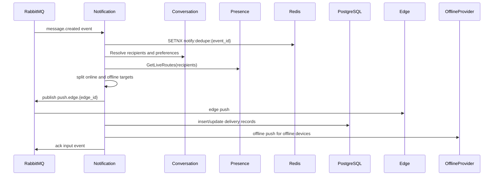

# Beehive-IM Notification 服务设计文档

> 版本：v1.0
> 适用范围：消息/会话事件消费、在线 Edge push、离线通知、通知偏好、设备 token、幂等去重和限流
> 关联文件：[`docs/conversation/DESIGN.md`](../conversation/DESIGN.md)、[`docs/presence/DESIGN.md`](../presence/DESIGN.md)、[`docs/gateway/DESIGN.md`](../gateway/DESIGN.md)、[`docs/infrastructure/infrastructure.md`](../infrastructure/infrastructure.md)

---

## 1. 目标与范围

Notification 服务负责把业务事件转换成用户可接收的通知。Message 服务只负责消息事实和 outbox 可靠发布；Notification 消费领域事件后，统一完成收件人解析、通知偏好判断、在线路由查询、在线 Edge push、离线 provider 推送、投递记录、幂等和限流。

### 1.1 职责

| 职责 | 说明 |
|------|------|
| 事件消费 | 消费 `message.created.#`、`conversation.updated.#` 等领域事件 |
| 收件人解析 | 调用 Conversation 或使用事件快照解析会话成员、免打扰和屏蔽关系 |
| 在线通知 | 调用 Presence `GetLiveRoutes`，按 `edge_id` 聚合并发布 `push.edge.{edge_id}` |
| 离线通知 | 查询设备 token 和通知偏好，调用 APNs/FCM/厂商通道 |
| 幂等去重 | 防止 RabbitMQ 重投、服务重启和 provider 重试导致重复通知 |
| 限流降级 | 按用户、会话、provider 和全局维度限流 |
| 投递记录 | 记录必要的 notification delivery 状态，便于审计和补偿 |

### 1.2 非职责

- 不保存消息事实，消息内容和序号以 Message/PostgreSQL 为准。
- 不直接管理 WebSocket 连接。
- 不直接读写 Presence Redis key。
- 不承担客户端可靠已读回执，回执仍属于 Message/Conversation 域。

---

## 2. 总体架构

```mermaid
flowchart LR
    Message[Message Service]
    Conversation[Conversation Service]
    Presence[Presence Service]
    Notification[Notification Service]
    Redis[(Redis)]
    PG[(PostgreSQL)]
    RMQ[(RabbitMQ)]
    Edge[Edge Service]
    Provider[Offline Push Providers]

    Message -->|outbox publish message.created| RMQ
    RMQ -->|durable queue| Notification
    Notification --> Conversation
    Notification --> Presence
    Notification --> Redis
    Notification --> PG
    Notification -->|push.edge.{edge_id}| RMQ
    RMQ --> Edge
    Notification --> Provider
```

核心边界：

- Message 发布领域事件，不直接查在线态，也不直接发布 Edge push。
- Notification 是在线/离线通知编排点。
- Presence 是在线路由事实服务。
- Edge 只消费自身 `edge.push.{edge_id}` 队列并写本地 WebSocket。

---

## 3. 事件与队列

### 3.1 输入事件

| Exchange | Routing key | Queue | 说明 |
|----------|-------------|-------|------|
| `beehive.im.events` | `message.created.#` | `notification.message.events` | 新消息通知 |
| `beehive.im.events` | `conversation.updated.#` | `notification.message.events` | 会话名、成员、免打扰等变更 |

输入事件必须包含：

| 字段 | 说明 |
|------|------|
| `event_id` | 全局唯一事件 ID，用于幂等 |
| `event_type` | `message.created` 等 |
| `conversation_id` | 会话 ID |
| `message_id` | 消息 ID，非消息事件可为空 |
| `sender_id` | 发送者 |
| `seq` | 会话内消息序号 |
| `occurred_at` | 事件发生时间 |
| `payload` | 精简业务载荷，不包含敏感明文 |

### 3.2 输出 Edge push

| Exchange | Routing key | Queue | 说明 |
|----------|-------------|-------|------|
| `beehive.im.push` | `push.edge.{edge_id}` | `edge.push.{edge_id}` | 推送到指定 Edge 实例 |

Edge push payload 建议：

```json
{
  "notification_id": "ntf_01",
  "event_id": "evt_01",
  "conversation_id": "conv_01",
  "message_id": "msg_01",
  "seq": 1024,
  "routes": [
    {
      "user_id": 1001,
      "device_id": "ios-01",
      "conn_id": "conn-01",
      "session_id": "sess-01"
    }
  ],
  "payload": {
    "type": "message",
    "preview": "redacted or short preview"
  }
}
```

Edge 必须在写入本地 WebSocket buffer 成功后 ack RabbitMQ 消息。Edge push 只是在线通知，客户端仍需要按 `conversation_id + seq` 从 Message 同步缺失消息。

### 3.3 Retry 与 DLQ

| 阶段 | 策略 |
|------|------|
| 事件消费失败 | `nack` 后进入有界重试或 retry exchange |
| Presence 查询超时 | 短退避重试；超过阈值转 DLQ 或只做离线策略 |
| Edge push 发布失败 | publisher confirm 失败后重试，不影响消息事实 |
| Provider 调用失败 | 按 provider 错误类型决定重试、熔断或丢弃 |
| DLQ | 任意新增必须告警，保留重放工具 |

---

## 4. 编排流程



处理顺序要求：

1. 先做事件级幂等，重复事件直接 ack。
2. 再解析收件人和通知偏好，发送者默认不通知自己，除非业务明确需要多端同步提示。
3. 查询 Presence，将在线设备放入 Edge push。
4. 离线设备按用户设置、平台能力和限流策略决定是否调用 provider。
5. 投递记录只保存必要审计信息，禁止保存完整敏感消息内容。

---

## 5. 数据模型

### 5.1 PostgreSQL

| 表 | 说明 |
|----|------|
| `notification_devices` | 用户设备 token、平台、状态、最近活跃时间 |
| `notification_preferences` | 用户级、会话级免打扰和通知策略 |
| `notification_deliveries` | 投递记录、状态、错误码、重试次数 |

`notification_devices` 建议字段：

| 字段 | 说明 |
|------|------|
| `id` | 主键 |
| `user_id` | 用户 ID |
| `device_id` | 客户端设备 ID |
| `platform` | `ios`、`android`、`web` 等 |
| `provider` | `apns`、`fcm`、厂商通道 |
| `token_ciphertext` | 加密后的 provider token |
| `status` | `active`、`disabled`、`invalid` |
| `last_seen_at` | 最近活跃时间 |

### 5.2 Redis

| Key | 类型 | TTL | 说明 |
|-----|------|-----|------|
| `notify:dedupe:{event_id}` | String | `notification.dedupe_ttl` | 事件级去重 |
| `notify:dedupe:{event_id}:{user_id}:{device_id}` | String | `notification.dedupe_ttl` | 设备级去重 |
| `notify:rate:{user_id}` | Counter | 短 TTL | 用户维度限流 |
| `notify:provider:{provider}:circuit` | String | 短 TTL | provider 熔断状态 |

---

## 6. 模块划分

```text
services/notification/
├── cmd/
│   └── main.go
├── config/
│   └── config.go
├── internal/
│   ├── consumer/
│   │   └── rabbitmq.go
│   ├── dispatcher/
│   │   ├── message.go
│   │   └── policy.go
│   ├── presence/
│   │   └── client.go
│   ├── conversation/
│   │   └── client.go
│   ├── provider/
│   │   ├── gateway.go
│   │   └── circuit_breaker.go
│   ├── repository/
│   │   ├── device_repo.go
│   │   ├── preference_repo.go
│   │   └── delivery_repo.go
│   └── dedupe/
│       └── redis.go
└── pkg/
```

### 6.1 关键接口

```go
// RecipientResolver resolves notification recipients and policies.
// RecipientResolver 解析通知收件人与投递策略。
type RecipientResolver interface {
    Resolve(ctx context.Context, event NotificationEvent) ([]RecipientTarget, error)
}

// PresenceClient resolves online routes from Presence service.
// PresenceClient 从 Presence 服务查询在线路由。
type PresenceClient interface {
    GetLiveRoutes(ctx context.Context, userID string) ([]ConnectionRoute, error)
}

// EdgePushPublisher publishes online push messages to RabbitMQ.
// EdgePushPublisher 向 RabbitMQ 发布在线 Edge push。
type EdgePushPublisher interface {
    PublishEdgePush(ctx context.Context, edgeID string, payload EdgePushPayload) error
}

// OfflineProvider sends platform push notifications.
// OfflineProvider 发送平台离线通知。
type OfflineProvider interface {
    Send(ctx context.Context, req OfflinePushRequest) (ProviderResult, error)
}
```

---

## 7. 幂等、限流与安全

### 7.1 幂等

| 层级 | Key | 说明 |
|------|-----|------|
| 事件级 | `event_id` | 防止同一 RabbitMQ 事件重复编排 |
| 用户级 | `event_id + user_id` | 防止同一用户重复通知 |
| 设备级 | `event_id + user_id + device_id` | 防止同一设备重复 provider push |
| Provider 级 | `provider_message_id` | provider 返回可追踪 ID 时记录 |

### 7.2 限流

| 维度 | 说明 |
|------|------|
| 用户 | 防止单用户被群消息刷屏 |
| 会话 | 大群或热点会话按会话限速 |
| Provider | APNs/FCM/厂商通道按配额限速 |
| 全局 | Notification worker pool 和 RabbitMQ prefetch 必须有限 |

### 7.3 安全

| 项 | 要求 |
|----|------|
| Provider token | 加密存储，禁止明文日志 |
| Provider secret | 存 etcd secrets 或专用 secret manager |
| 消息预览 | 按会话设置和隐私策略生成，禁止泄露敏感内容 |
| 内部调用 | Presence、Conversation、RabbitMQ 使用内网 TLS 或受控 ACL |
| 日志 | 英文结构化日志，禁止记录完整 token、secret、手机号、邮箱 |

---

## 8. 可观测性

| 指标 | 说明 |
|------|------|
| `notification_event_lag_ms` | RabbitMQ 事件滞后 |
| `notification_dedupe_hit_total` | 幂等命中次数 |
| `notification_online_push_success_total` | 在线 push 成功 |
| `notification_online_push_failed_total` | 在线 push 失败 |
| `notification_offline_provider_latency_ms` | 离线 provider 延迟 |
| `notification_rate_limited_total` | 限流次数 |
| `notification_dlq_total` | DLQ 数量 |

告警建议：

- `notification_event_lag_ms` 连续 5 分钟超过在线 push TTL 的 50%。
- `notification_dlq_total` 任意新增即告警。
- 单 provider 5 分钟错误率超过 5% 时进入熔断并告警。

---

## 9. 风险与缓解

| 风险 | 影响 | 缓解 |
|------|------|------|
| Notification 堆积 | 在线通知延迟，离线通知错过时效 | 有限 prefetch、水平扩容、DLQ、事件滞后告警 |
| 重复消费 | 用户收到重复通知 | 多层幂等 key、投递记录唯一索引 |
| Presence 查询失败 | 在线用户无法实时收到 push | 短重试、降级到客户端同步、必要时离线策略 |
| Provider 故障 | 离线通知失败 | 超时、熔断、备用 provider、失败记录 |
| 大群通知放大 | MQ、Presence、provider 压力升高 | 收件人分页、按 Edge 聚合、限流和摘要通知 |

---

## 10. 验收清单

- [ ] Message 不直接查询 Presence，也不直接发布 `push.edge`。
- [ ] Notification 使用 durable queue 消费领域事件，并支持重试和 DLQ。
- [ ] 输入事件、在线 push 和离线 provider 都具备幂等策略。
- [ ] 在线 push 通过 Presence 查询路由，并按 `edge_id` 聚合发布。
- [ ] 离线 provider 调用具备超时、熔断、限流和错误分类。
- [ ] 设备 token 加密存储，日志不输出 token 或 secret。
- [ ] 指标和告警覆盖 event lag、DLQ、provider latency、dedupe、rate limit。
