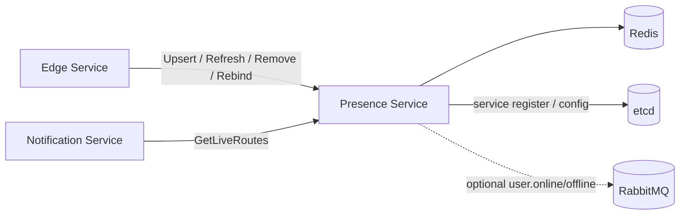

# Beehive-IM Presence 服务设计文档

> 版本：v1.0
> 适用范围：在线态、连接路由、Gateway rebind 路由更新、Presence API、Redis 运行态存储
> 关联文件：[`docs/gateway/DESIGN.md`](../gateway/DESIGN.md)、[`docs/message/DESIGN.md`](../message/DESIGN.md)、[`docs/notification/DESIGN.md`](../notification/DESIGN.md)、[`docs/infrastructure/DESIGN.md`](../infrastructure/DESIGN.md)

---

## 1. 目标与范围

Presence 服务负责 IM 在线态事实的服务化边界。Edge 仍然拥有客户端 WebSocket 连接，但所有在线态写入、续期、断开清理、Gateway rebind 路由更新和在线路由查询都必须通过 Presence API 完成。

### 1.0 当前实现状态

当前已落地第一版 Presence zRPC 服务，目标是支撑 Edge/Gateway 接入闭环：

| 能力 | 当前状态 |
|------|----------|
| 服务骨架 | 已通过 `proto/presence.proto` 生成 `services/presence` |
| Redis 写入 | 已实现 `conn:user:{user_id}`、`conn:edge:{edge_id}`、`conn:meta:{conn_id}`、`session:route:{session_id}` |
| Edge 接入 | Edge WebSocket 建连时调用 `UpsertConnection`，断开时调用 `RemoveConnection` |
| 查询与清理 | 已实现 `GetLiveRoutes`、`RefreshConnection`、`RebindGateway`、`CleanupEdge` 的最小版本 |
| 未完成项 | Lua 脚本、批量心跳、指标、在线事件发布和 mTLS 鉴权后续补齐 |

### 1.1 职责

| 职责 | 说明 |
|------|------|
| 连接注册 | 接收 Edge 的 `UpsertConnection`，写入用户设备索引、连接元数据和 session route |
| 心跳续期 | 接收 Edge 的 `RefreshConnection`，延长连接元数据和 session route TTL |
| Gateway rebind | 接收 Edge 的 `RebindGateway`，原子更新当前上游 Gateway |
| 连接清理 | 接收 Edge 的 `RemoveConnection` / `CleanupEdge`，使用 compare-and-delete 防止误删新连接 |
| 在线路由查询 | 为 Notification 等内部服务提供 `GetLiveRoutes` |
| 在线事件 | 可选发布 `user.online` / `user.offline` 事件，供审计或状态展示消费 |

### 1.2 非职责

- 不终止客户端 WebSocket 连接。
- 不保存消息事实、会话成员、消息回执或离线通知。
- 不直接调用移动厂商推送 provider。
- 不替代 Edge 的本地连接管理和背压控制。

### 1.3 设计原则

| 原则 | 要求 |
|------|------|
| 单一写入口 | 在线态 Redis key 只能由 Presence 写入 |
| 原子性 | 覆盖登录、续期、rebind、断开必须使用 Lua 或 Redis 事务 |
| 可恢复 | Redis 状态允许短暂不一致，但必须可通过 TTL 和清理任务恢复 |
| 高并发 | 高频心跳必须支持批量、pipeline、限流和 deadline |
| 最小暴露 | Presence 只暴露内网 gRPC，不暴露公网 |

---

## 2. 总体架构



Edge 只保留本地连接对象和上游 Gateway stream；Presence 只保存短 TTL 在线态和索引。Gateway 崩溃时，Edge 选择新 Gateway 并调用 Presence 更新 `session:route.gateway_id`。

---

## 3. API 契约

v1 推荐使用 gRPC。所有接口必须带 `context.Context` deadline，生产环境内部调用使用 mTLS 或受控服务身份。

### 3.1 RPC 一览

| RPC | 调用方 | 说明 |
|-----|--------|------|
| `UpsertConnection` | Edge | 建立或覆盖用户设备连接 |
| `RefreshConnection` | Edge | 续期连接和 session route |
| `RebindGateway` | Edge | 更新 session 当前 Gateway |
| `RemoveConnection` | Edge | 断开单连接并清理索引 |
| `CleanupEdge` | Edge / 运维任务 | 清理某个 Edge 的残留连接 |
| `GetLiveRoutes` | Notification / 内部服务 | 查询用户当前在线路由 |
| `GetPresence` | User / API Gateway | 查询用户在线状态摘要 |

### 3.2 核心消息

```proto
message ConnectionMeta {
  string conn_id = 1;
  string session_id = 2;
  int64 user_id = 3;
  string device_id = 4;
  string edge_id = 5;
  string gateway_id = 6;
  int64 last_client_seq = 7;
  int64 last_delivered_seq = 8;
  int64 connected_at_unix_ms = 9;
}

message ConnectionRoute {
  string conn_id = 1;
  string session_id = 2;
  int64 user_id = 3;
  string device_id = 4;
  string edge_id = 5;
  string gateway_id = 6;
  int64 last_seen_at_unix_ms = 7;
}
```

### 3.3 语义要求

| RPC | 成功语义 | 失败语义 |
|-----|----------|----------|
| `UpsertConnection` | 新连接成为当前设备连接；返回被覆盖的旧路由 | Redis 不可用返回 `UNAVAILABLE`；字段非法返回 `INVALID_ARGUMENT` |
| `RefreshConnection` | 仅当前 `edge_id + conn_id` 匹配时续期 | 路由被覆盖返回 `FAILED_PRECONDITION` |
| `RebindGateway` | 仅当前 session 仍属于该连接时更新 Gateway | session 过期或被覆盖返回 `FAILED_PRECONDITION` |
| `RemoveConnection` | 仅当前 value 匹配时删除索引 | 已被新连接覆盖时返回 `removed=false` |
| `GetLiveRoutes` | 返回已校验 meta 和 route 的活跃连接 | 超时返回部分失败错误，不返回未校验路由 |

---

## 4. Redis 数据模型

Redis key 必须带环境前缀：

```text
beehive:{env}:{logical_key}
```

| Logical key | 类型 | TTL | 说明 |
|-------------|------|-----|------|
| `conn:user:{user_id}` | Hash | 无 | `device_id -> edge_id:conn_id:session_id`，只作为索引 |
| `conn:edge:{edge_id}` | Set | 无 | Edge 当前连接集合，只作为清理索引 |
| `conn:meta:{conn_id}` | Hash | `presence_ttl` | 连接元数据；活跃判定以该 key 存在为准 |
| `session:route:{session_id}` | Hash | `presence_ttl` | 当前 Edge、连接和 Gateway 路由 |
| `presence:user:{user_id}` | Hash | 短 TTL | 可选在线摘要，用于列表页快速展示 |

### 4.1 不变量

| 不变量 | 说明 |
|--------|------|
| `conn:meta` 是活跃判定依据 | `conn:user` 和 `conn:edge` 只是索引，读取时必须回查 meta |
| 同设备只保留最新连接 | `user_id + device_id` 后登录覆盖先登录 |
| 断开必须 compare-and-delete | 旧连接不能删除同设备新连接 |
| rebind 必须 compare-and-set | 只有当前 session 仍属于该 Edge 连接时才能更新 Gateway |
| 索引残留可接受 | 通过 TTL、查询时修复和定时清理收敛 |

### 4.2 Upsert 原子脚本

```text
old = HGET conn:user:{user_id} {device_id}
HSET conn:user:{user_id} {device_id} {edge_id}:{conn_id}:{session_id}
SADD conn:edge:{edge_id} {conn_id}
HSET conn:meta:{conn_id} user_id ... device_id ... edge_id ... gateway_id ... session_id ...
HSET session:route:{session_id} edge_id ... conn_id ... gateway_id ... user_id ... device_id ...
EXPIRE conn:meta:{conn_id} {presence_ttl}
EXPIRE session:route:{session_id} {presence_ttl}
return old
```

如果返回旧路由，Edge 应向旧连接所在 Edge 发出踢下线通知；跨 Edge 关闭失败时允许依赖 TTL 收敛。

### 4.3 Refresh 原子脚本

```text
if HGET conn:meta:{conn_id} edge_id == {edge_id}
then HSET conn:meta:{conn_id} last_seen_at {now}
     EXPIRE conn:meta:{conn_id} {presence_ttl}
     EXPIRE session:route:{session_id} {presence_ttl}
else return stale_connection
```

续期失败表示该连接已经过期或被新连接覆盖，Edge 必须关闭本地 WebSocket。

### 4.4 Remove 原子脚本

```text
current = HGET conn:user:{user_id} {device_id}
if current == {edge_id}:{conn_id}:{session_id}
then HDEL conn:user:{user_id} {device_id}
SREM conn:edge:{edge_id} {conn_id}
DEL conn:meta:{conn_id}
DEL session:route:{session_id}
```

---

## 5. 高并发策略

| 场景 | 策略 |
|------|------|
| 连接建立突增 | Edge 调用 Presence 前先做本地连接限流；Presence 使用有界 worker 和 Redis 连接池 |
| 高频心跳 | 支持批量续期或内部合并；使用 pipeline / Lua 降低 RTT |
| 大群通知查询 | `GetLiveRoutes` 限制单次用户数和最大返回连接数，超限分页或分批 |
| Redis 慢查询 | Presence 设置 per-command deadline，超时快速失败并记录指标 |
| 清理任务 | 游标扫描、小批量、可暂停，禁止阻塞在线写入 |

---

## 6. 安全要求

| 项 | 要求 |
|----|------|
| 暴露边界 | Presence 只暴露内网 gRPC |
| 服务身份 | Edge、Notification 等调用方必须通过 mTLS 或内部服务 token 鉴权 |
| 权限 | Redis 账号只允许访问 Presence 所需 key 前缀 |
| 数据脱敏 | 日志只记录 hash 后的用户 ID 或连接 ID 前缀 |
| 防滥用 | `GetLiveRoutes` 按调用方、用户数和 QPS 限流 |

---

## 7. 可观测性

| 指标 | 说明 |
|------|------|
| `presence_upsert_latency_ms` | 连接注册延迟 |
| `presence_refresh_latency_ms` | 心跳续期延迟 |
| `presence_route_lookup_latency_ms` | 在线路由查询延迟 |
| `presence_stale_route_total` | 查询或续期发现的残留路由数 |
| `presence_redis_script_error_total` | Redis Lua 执行失败数 |
| `presence_cleanup_deleted_total` | 清理任务删除的孤儿连接数 |

日志必须使用英文，包含 `trace_id`、`edge_id`、`conn_id`、`operation`、`duration_ms`、`error_code`，禁止记录 token 和完整隐私字段。

---

## 8. 风险与缓解

| 风险 | 影响 | 缓解 |
|------|------|------|
| Presence 不可用 | 新连接注册、续期、在线推送路由受影响 | 多副本、限流、deadline、Redis 连接池隔离、告警 |
| Redis 内存淘汰 | 在线态丢失 | 独立 Redis、合理 eviction policy、内存告警 |
| 同设备快速重连 | 旧连接清理误删新连接 | compare-and-delete |
| 清理任务误删 | 在线用户被误判下线 | 只删除 meta 缺失或 owner 不匹配的索引，清理限速 |
| 大群路由查询放大 | Redis 压力升高 | 批量限制、分页、Notification 聚合和限流 |

---

## 9. 验收清单

- [ ] Edge 不直接读写在线态 Redis key。
- [ ] `UpsertConnection`、`RefreshConnection`、`RebindGateway`、`RemoveConnection` 使用 Lua 或 Redis 事务保证原子性。
- [ ] `RemoveConnection` 是 compare-and-delete。
- [ ] `GetLiveRoutes` 返回前校验 `conn:meta` 和 `session:route`。
- [ ] Presence 具备连接池、deadline、限流、指标和结构化日志。
- [ ] 清理任务支持批量大小配置、游标恢复和安全暂停。
